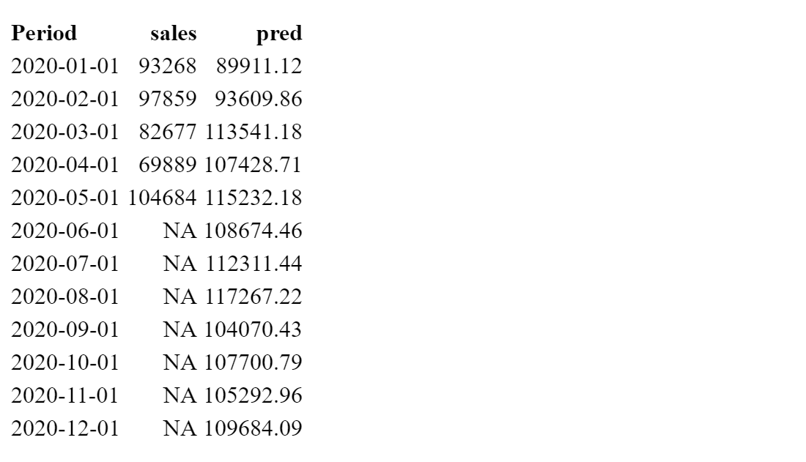

```{r setup, include=FALSE}
library(scales)
library(tidyverse)
library(plotly)
library(lubridate)
library(broom)
library(modelr)
library(readxl)
library(zoo)
library(caret)
theme_set(theme_bw())

knitr::opts_chunk$set(
	echo = TRUE,
	message = FALSE,
	warning = FALSE
)
```

# Introduction
We replicate some of the results from paper [Predicting the Present with Google Trends.](http://people.ischool.berkeley.edu/~hal/Papers/2011/ptp.pdf). We focused on 3.1 Motor vehicles and parts. We were able to replicate everything in that session using original data. There were many difficulties on finding the right data. 

# Replicate results from 3.1 Motor vehicles and parts
## Replication with authors' data
### Replicate baseline seasonal AR-1 model

We began the replication process by using the data that was used for the paper. According to the paper, the model follows the form of $y_t = b_1y_{t-1}+b_{12}y_{t-12}+e_t$(AR-1 model). We used the codes below to obtain the same summary table of the model.

```{r}
# load the data that was used for the paper
merged <- read_csv("merged.csv")

# take the log of all sales values
merged$sales<-log(merged$sales)

# apply lm(). lag() is used to capture y_t-1 and y_t-12
model1 <- lm(data = merged, sales~lag(sales, 1)+lag(sales,12))

#the summary of the model
summary(model1)
```

The summary we obtained is identical to the paper. 


### Replicate the model with trends

According to the paper, we added two trends, *Trucks & SUVs* and *Automotive Insurance* to the previous model. 

```{r}
# model with trends
model_with_trend <- lm(data = merged, sales~lag(sales, 1)+lag(sales,12) + suvs + insurance)
# model.matrix(lm(data = merged, sales~lag(sales, 1)+lag(sales,12) + suvs + insurance))
# summary table of the model

summary(model_with_trend)
```

Once again, the summary we obtained is identical to the paper.

### Replicate figure 2 

The authors used rolling window forecast to confirm that the Google Trends data improves out-of-sample forecasting. 
What is rolling window forecast? 
That's say now is July, 2005. We would use all the actual data that is available to train a model and predict August, 2005. We'll keep predicted value aside. Imagine now is August, 2005, we have all the actual data(up to July, 2005) available to train another model to predict September, 2005. Repeat this process for baseline model and the model with trends as predictors. 

```{r}

# creating base 
base <- merged # a place holder for predicted sales from baseline model
# rolling window forcast
for (i in 18:91){
  merged_t <- merged[1:i-1,]
  model1 <- lm(data = merged_t, sales~lag(sales, 1)+lag(sales,12))
  base$sales[i] <- predict(model1,merged[1:i,])[i]
}
base <- base[18:91,]# select out all the predicted sales


# creating trends 
trends <- merged
for (i in 18:91){
  merged_t <- merged[1:i-1,]
  model1 <- lm(data = merged_t, sales~lag(sales, 1)+lag(sales,12)+ suvs + insurance)
  trends$sales[i] <- predict(model1,merged[1:i,])[i]
}
trends <- trends[18:91,]


# Make the graph
# add labels to the data
actual <- merged[18:91,] %>% 
  mutate(label ="actual")
base <- base %>% 
  mutate(label = "base")
trends <- trends %>% 
  mutate(label ="trends")

# means absolute error
mean(abs(trends$sales-actual$sales))
mean(abs(base$sales-actual$sales))

# data for the recession period Dec 2007 to June 2009
recession_trends <- trends %>% 
  filter(Period>="2007-12-01"& Period<="2009-06-01")
recession_base <- base %>% 
  filter(Period>="2007-12-01"& Period<="2009-06-01")
recession_actual <- actual %>% 
  filter(Period>="2007-12-01"& Period<="2009-06-01")

# means absolute error for the recession period
# MAE for the model with trends
mean(abs(recession_trends$sales-recession_actual$sales))

# MAE for the model for baseline model
mean(abs(recession_base$sales-recession_actual$sales))


# Overall improvement 
(mean(abs(base$sales-actual$sales))-mean(abs(trends$sales-actual$sales)))/mean(abs(base$sales-actual$sales))


# recession improvement
(mean(abs(recession_base$sales-recession_actual$sales))-mean(abs(recession_trends$sales-recession_actual$sales)))/mean(abs(recession_base$sales-recession_actual$sales))

# Note: the improvements they stated in the paragraph were different from what they labeled on the graph. First, I thought they used some kind of function, but the MAE() from library(caret) gives same value.


# R^2 for base
(cor(base$sales,actual$sales))^2

# R^2 for trends
(cor(trends$sales,actual$sales))^2

# combine data for plotting
plot_data <- rbind(actual, base, trends)
ggplot(plot_data, aes(x=Period, y = sales, color = label, linetype = label))+
  geom_line()+
  scale_colour_manual(values=c("black", "red","grey"))+
  scale_linetype_manual(values = c("solid", "dashed", "solid"))+
  ylab('log(mvp)')+
  xlab('Index')+
  labs(subtitle ="MAE improvement: Overall = 10.66%  During recession = 21.46%" )
```

The outcomes we got matched with the ones on the paper. 

## Replication with raw data

### Where did we find the data?

**The sales data**:
We first tried the [link](https://www.census.gov/retail/marts/www/timeseries.html) provided in the paper, but the data is adjusted. We were able to find the unadjusted data through this [link](https://www.census.gov/econ/currentdata/dbsearch?program=MARTS&startYear=2004&endYear=2020&categories%5B%5D=441&dataType=SM&geoLevel=US&notAdjusted=1&submit=GET+DATA&releaseScheduleId=). However, the values were different from the original data(used by the authors of the paper). The difference increases as year increases. The reason for that is still unclear. We will compare the two data set in the next session.

**The search data**:
[Trucks & SUVs](https://trends.google.com/trends/explore?cat=610&date=2004-01-01%202011-07-01&geo=US)
and 
[Auto Insurance](https://trends.google.com/trends/explore?cat=467&date=2004-01-01%202011-07-01&geo=US)


### Comparing sales data used in the paper with data we obtained from census.gov

We noticed that the sales values from the data we obtained was always less than the data used in the paper.

```{r}
# load the data
sales <- read_excel("sales.xls")
merged <- read_csv("merged.csv")
# Period has type char in the data, convert that to yearmonth 
ym <- as.yearmon(sales$Period, "%b-%Y")
# use as.Date() to convert the type of ym to date
sales$Period <- as.Date(ym)
#keep only data from 01/2004 through 07/2011 and renames the data frame as unadj, rename the column Value as sales,and add label "unadjusted"
unadj<- sales %>% 
  filter(Period <="2011-07-01") %>% 
  mutate(label = "unadjusted") %>% 
  rename(sales = Value)
# convert sales to numeric 
unadj$sales <-as.numeric(unadj$sales)
# add label to original data, keep only Period, sales and label
orig <- merged %>% 
  mutate(label = "original") %>% 
  select(-insurance, -suvs)
# stack two data frame
com_data <- rbind(unadj, orig)

#plot log(sales) Vs Period 
ggplot(com_data, aes(x=Period, y = log(sales), color = label)) +
  geom_line()

# plot orignal against unadjusted
joined_data <- unadj %>% select(-label) %>% rename(unadjusted_sales = sales) %>% left_join(orig, by ="Period") %>% select(-label)

ggplot(joined_data, aes(x = sales, y = unadjusted_sales)) +
  geom_point()+
  geom_abline(linetype = "dashed") +
  xlab('original') +
  ylab('unadjusted')+
  ggtitle("original sales against unadjusted sales")
```

From the first graph, we can see that the sales values from both original and unajusted data are very close to each other(almost overlapping). When I plotted original data against unadjusted data, they almost lined up on the diagonal. Note that original is always less than unadjusted. I wonder if people went back and modified that data after the authors obtained the data. Further investigation is needed. In conclusion, the unadjusted data we found is very close to the original data. 

### Attempts to find the transformation on Google Trends data in original data

The authors did not specify what kind of transformation/normalization/standardization they performed on Google Trends data. 
Below are what we have tried to transform trends data.

1. new_value = (old_value-first_observed_value)/max(old_value)
2. Min-Max Normalization
3. Use scale()

None of these match with the original data. Therefore, we decided to process without any transformation on Google Trends data. 

We also tried other key words like "Buy car", "car dealer", "Vehicle shop" and so on, but none of these were significant to the model

### Replicate the results again with unadjusted data from census.gov with trends data from original paper

We would like to compare the outputs of unadjusted data with the outputs from the original data with same trends data.

```{r}
#take the log of sales, take out the label column
unadj_rep <- unadj %>% mutate(sales=log(sales)) %>% select(-label)

# google_trends contains trends data and Period for join
google_trends <- merged %>% select(-sales)

# join trends to unadj_rep
unadj_with_trends <- unadj_rep %>% left_join(google_trends, by = "Period")

# replicate baseline model
model1 <- lm(data = unadj_with_trends, sales~lag(sales, 1)+lag(sales,12))

#the summary of the model
#summary(model1)


# replicate the model with trends
model_with_trend <- lm(data = unadj_with_trends, sales~lag(sales, 1)+lag(sales,12) + suvs + insurance)
#summary(model_with_trend)

# replicate figure 2

# creating base 
base_unajusted <- unadj_with_trends
for (i in 18:91){
  merged_t <- unadj_with_trends[1:i-1,]
  model1 <- lm(data = merged_t, sales~lag(sales, 1)+lag(sales,12))
  base_unajusted$sales[i] <- predict(model1,unadj_with_trends[1:i,])[i]
}
base_unajusted <- base_unajusted[18:91,]


# creating trends 
trends_unajusted <- unadj_with_trends
for (i in 18:91){
  merged_t <- unadj_with_trends[1:i-1,]
  model1 <- lm(data = merged_t, sales~lag(sales, 1)+lag(sales,12) + suvs + insurance)
  trends_unajusted$sales[i] <- predict(model1,unadj_with_trends[1:i,])[i]
}
trends_unajusted <- trends_unajusted[18:91,]


# label different data sets
actual_unajusted <- unadj_with_trends[18:91,]
actual_unajusted <- actual_unajusted %>%
  mutate(label ="actual_unajusted")
base_unajusted <- base_unajusted %>%
  mutate(label = "base_unajusted")
trends_unajusted <- trends_unajusted %>%
  mutate(label ="trends_unajusted")

# R^2 for base
r_base <- (cor(base_unajusted$sales,actual_unajusted$sales))^2

# R^2 for trends
r_trend <- (cor(trends_unajusted$sales,actual_unajusted$sales))^2


# stack all data sets for plotting
plot_data <- rbind(actual, base, trends, actual_unajusted, base_unajusted, trends_unajusted)
ggplot(plot_data, aes(x=Period, y = sales, color = label, linetype = label))+
  geom_line()+
  scale_colour_manual(values=c("black","black", "red","red","grey","grey"))+
  scale_linetype_manual(values = c("solid","solid","dashed", "dashed", "solid","solid"))+
  ylab('log(mvp)')+
  xlab('Index')
```

From the graph, we see that lines are almost overlapped, and $R^2$ are very close to the ones from original data, `r  r_base` for the base and `r r_trend` for the one with trends. 


### Replicate the results with unadjusted data from census.gov and search data from Google Trends without unknown transformations 

We found that the trends data was significant to the model even without the transformation for the time period 01/01/2004 to 07/01/2011. 

```{r}
# trend 1 
# search data in category Trucks & SUVs between 01/01/2004 and 07/01/2011
suvs_trends <- read_csv("New_Trucks_suvs.csv")
names1<- names(suvs_trends)
suvs_trends <- suvs_trends %>%
  rename(suvs = names1[2],
         Period = Month)

# trend 2
# search data in category Auto Insurance between 01/01/2004 and 07/01/2011
insurance_trends <- read_csv("New_auto_insurance.csv")
names2 <- names(insurance_trends)
insurance_trends <- insurance_trends %>%
  rename(insurance = names2[2],
         Period = Month)

# census data 
unadj_full <- sales %>% filter(Period <= "2011-07-01")

#join trends data
trends_full <- left_join(insurance_trends, suvs_trends, by = "Period") %>% mutate(Period = as.Date(as.yearmon(Period, "%Y-%m")))

# join all data
with_trends_full <- left_join(unadj_full, trends_full, by = "Period") %>% rename(sales = Value) 

# take the log of sales
with_trends_full$sales = log(as.numeric(with_trends_full$sales))


# apply lm(). lag() is used to capture y_t-1 and y_t-12
model1 <- lm(data = with_trends_full, sales~lag(sales, 1)+lag(sales,12))


# summary of model1
tidy(model1)
m1 <- glance(model1)


# model with previous month's trends data
model_with_trend_pre_month <- lm(data = with_trends_full, sales~lag(sales, 1)+lag(sales,12) +lag(suvs,1) + lag( insurance,1))
tidy(model_with_trend_pre_month)
mtp<-glance(model_with_trend_pre_month)


# model with current month's trends(we don't have weekly data, so we are using the monthly data instead)
model_with_trend_current <- lm(data = with_trends_full, sales~lag(sales, 1)+lag(sales,12) + suvs + insurance)
# summary table of the model
# summary(model_with_trend)
tidy(model_with_trend_current)
mtc<-glance(model_with_trend_current)
```

The $R^2$ for base model is `r m1$r.squared`, the $R^2$ for the model with trends data from previous month is `r mtp$r.squared`, and the $R^2$ for the model with trends data from current month is `r mtc$r.squared`. We see an improvement in overall fitness when trends data were from current month (since we don't have access to the trends data of the first week of the month, we are using the month data as an estimator). We will further investigate if this is true with out-of-sample forecasting.


### Evaluate the model by using rolling window forecast starting from 2005-07-01(with trends data from current month)

We evaluated the model on out-of-sample forecasting, and we found that the trends data made the predictions less accurate. 

```{r}
base <- with_trends_full
# creating predicted base with rolling window nowcast
for (i in 18:91){
  merged_t <- with_trends_full[1:i-1,]
  model1 <- lm(data = merged_t, sales~lag(sales, 1)+lag(sales,12))
  base$sales[i] <- predict(model1,with_trends_full[1:i,])[i]
}
base <- base[18:91,]


# creating predicted trends with rolling window nowcast

trends <- with_trends_full
for (i in 18:91){
  merged_t <- with_trends_full[1:i-1,]
  model1 <- lm(data = merged_t, sales~lag(sales, 1)+lag(sales,12)+ suvs + insurance)
  trends$sales[i] <- predict(model1,with_trends_full[1:i,])[i]
}
trends <- trends[18:91,]

# Make the graph

actual <- with_trends_full[18:91,]
actual <- actual %>% 
  mutate(label ="actual")
base <- base %>% 
  mutate(label = "base")
trends <- trends %>% 
  mutate(label ="trends")
plot_data <- rbind(actual, base, trends) 
ggplotly(ggplot(plot_data, aes(x=Period, y = sales, color = label, linetype = label))+
  geom_line()+
  scale_colour_manual(values=c("black", "red","grey"))+
  scale_linetype_manual(values = c("solid", "dashed", "solid"))+
  ylab('log(mvp)')+
  xlab('Index'))
```


##### Calculate Mean Absolute Error and R^2 (with raw data)

```{r}
# means absolute error
MAE_base <- mean(abs(base$sales-actual$sales))
MAE_trends <- mean(abs(trends$sales-actual$sales))

# data for recession period Dec 2007 to June 2009
recession_trends <- trends %>% 
  filter(Period>="2007-12-01"& Period<="2009-06-01")
recession_base <- base %>% 
  filter(Period>="2007-12-01"& Period<="2009-06-01")
recession_actual <- actual %>% 
  filter(Period>="2007-12-01"& Period<="2009-06-01")
MAE_recession_trends <- mean(abs(recession_trends$sales-recession_actual$sales))
MAE_recession_base <- mean(abs(recession_base$sales-recession_actual$sales))


# Overall improvement 
overall_improv <- (mean(abs(base$sales-actual$sales))-mean(abs(trends$sales-actual$sales)))/mean(abs(base$sales-actual$sales))


# recession improvement
recession_improv <- (mean(abs(recession_base$sales-recession_actual$sales))-mean(abs(recession_trends$sales-recession_actual$sales)))/mean(abs(recession_base$sales-recession_actual$sales))


#R^2 for base
r_sqr_base <-(cor(base$sales,actual$sales))^2

# R^2 for trends
# r_sqr_trends <- (cor(trends$sales[3:73],actual$sales[3:73]))^2
r_sqr_trends <- (cor(trends$sales,actual$sales))^2
#We can use MAE() from caret package to calculate MAE
# 
# library(caret)
#  
# # R native funcitons
# MAE(recession_trends$sales, recession_actual$sales)
# MAE(recession_base$sales, recession_actual$sales)
# 
# MAE(trends$sales, actual$sales)
# MAE(base$sales, actual$sales)

```

The MAE for base model is `r MAE_base`, and the MAE for the model with trends is `r MAE_trends`. The overall improvement is `r overall_improv*100`%. That means adding trends to the model make things worse. We see a totally different story when forces on recession period. The MAE for base model is `r MAE_recession_base`, and the MAE for the model with trends is `r MAE_recession_trends` during the recession. There is `r recession_improv*100`% improvement after adding trends to the model. 


# Extensions

## Replication with data between 08/01/2011- 12/01/2019 

The model produced higher $R^2$ for time period 08/01/2011 to 12/01/2019. However, the trends data did not improve the performance. 

```{r}
suvs_trends <- read_csv("trucks_suvs_2004_2020.csv")
insurance_trends <- read_csv("auto_insurance_2004_2020.csv")
# rename
names1<- names(suvs_trends)
names2 <- names(insurance_trends)
suvs_trends <- suvs_trends %>% 
  rename(suvs = names1[2],
         Period = Month)
insurance_trends <- insurance_trends %>% 
  rename(insurance = names2[2], 
         Period = Month)

start_month <- "2011-07-01" # "2004-01-01"
end_month <- "2019-12-01"   # "2020-05-01"

unadj_full <- sales %>% filter(Period <= end_month & Period >start_month)
trends_full <- left_join(insurance_trends, suvs_trends, by = "Period") %>% mutate(Period = as.Date(as.yearmon(Period, "%Y-%m"))) 
with_trends_full <- left_join(unadj_full, trends_full, by = "Period") %>% rename(sales = Value) 
with_trends_full$sales = log(as.numeric(with_trends_full$sales))

# apply lm(). lag() is used to capture y_t-1 and y_t-12
model1 <- lm(data = with_trends_full, sales~lag(sales, 1)+lag(sales,12))

#the summary of the model
summary(model1)

# model with trends
model_with_trend <- lm(data = with_trends_full, sales~lag(sales, 1)+lag(sales,12) + suvs + insurance)

# summary table of the model
summary(model_with_trend)

# Rolling window 
base <- with_trends_full
len <- nrow(base)
# creating predicted base with rolling window forecast
for (i in 18:len){
  merged_t <- with_trends_full[1:i-1,]
  model1 <- lm(data = merged_t, sales~lag(sales, 1)+lag(sales,12))
  base$sales[i] <- predict(model1,with_trends_full[1:i,])[i]
}
base <- base[18:len,]


# creating predicted trends with rolling window forecast
trends <- with_trends_full
for (i in 18:len){
  merged_t <- with_trends_full[1:i-1,]
  model1 <- lm(data = merged_t, sales~lag(sales, 1)+lag(sales,12)+ suvs + insurance)
  trends$sales[i] <- predict(model1,with_trends_full[1:i,])[i]
}
trends <- trends[18:len,]

# Make the graph
actual <- with_trends_full[18:len,]
actual <- actual %>% 
  mutate(label ="actual")
base <- base %>% 
  mutate(label = "base")
trends <- trends %>% 
  mutate(label ="trends")

# R^2 for baseline model 
r_sqr_base <-(cor(base$sales,actual$sales))^2

# R^2 for model with trends
r_sqr_trends <- (cor(trends$sales,actual$sales))^2


plot_data <- rbind(actual, base, trends)
ggplotly(ggplot(plot_data, aes(x=Period, y = sales, color = label, linetype = label))+
  geom_line()+
  scale_colour_manual(values=c("black", "red","grey"))+
  scale_linetype_manual(values = c("solid", "dashed", "solid"))+
  ylab('log(mvp)')+
  xlab('Index'))


```

For data between `r start_month` and `r end_month`. We don't see much improvement on the fitness of the model when trends data was included. When we applied rolling window forecasting, we got $R^2$ = `r r_sqr_base` for baseline model, and $R^2$ = `r r_sqr_trends` for the model with trends data. This is suggesting that adding trends data to the model may decreases prediction accuracy. We also tried this procedure with data from different time period, the results are similar. 


## Forecasting with new model

We would to like to explore new models for forecasting. We examined two models. At the end, We will try to predict the sales of July, 2020 using these models. 

### Model 1: $y_{t+2}=b_1y_{t}+b_2y_{t-12} + e_t$ 

We want forecast by using the baseline model $y_{t+2}=b_1y_{t}+b_2y_{t-12} + e_t$ and the model $y_{t+2}=b_1y_{t}+b_2y_{t-12} + b_3insurance + b_4SUVs + e_t$ (search data from month t). We'll use rolling window forecast to evaluate our model(from 01/01/2017 to 01/01/2019) . 


```{r}
## getting data ready
suvs_trends <- read_csv("trucks_suvs_2004_2020.csv")
insurance_trends <- read_csv("auto_insurance_2004_2020.csv")
# rename
names1<- names(suvs_trends)
names2 <- names(insurance_trends)
suvs_trends <- suvs_trends %>% 
  rename(suvs = names1[2],
         Period = Month)

insurance_trends <- insurance_trends %>% 
  rename(insurance = names2[2], 
         Period = Month)
unadj_full <- sales %>% filter(Period <= "2020-05-01")


##Join data
trends_full <- left_join(insurance_trends, suvs_trends, by = "Period") %>% mutate(Period = as.Date(as.yearmon(Period, "%Y-%m"))) 
with_trends_full <- left_join(unadj_full, trends_full, by = "Period") %>% rename(sales = Value) 
with_trends_full$sales = log(as.numeric(with_trends_full$sales))
#with_trends_full$sales = as.numeric(with_trends_full$sales)


## starting from 2017
whole_data_2017 <- with_trends_full %>% 
  filter(Period >="2013-01-01" & Period <="2019-01-01") # we want to start predict 2017-01-01 when it is 2016-10-01, we need data from at least from 2015-10-01 (We want more data before first prediction to train a good model)
months <- nrow(whole_data_2017)

 
base <- whole_data_2017
start <- 46 # the index for 2016-10-01
# creating predicted base with rolling window nowcast
for (i in start:months){
  merged_t <- whole_data_2017[1:i-1,]
  model1 <- lm(data = merged_t, sales~lag(sales, 2)+lag(sales,14))
  base$sales[i] <- predict(model1,whole_data_2017[1:i,])[i]
}
base <- base[start:months,]


# creating predicted trends with rolling window nowcast

trends <- whole_data_2017
for (i in start:months){
  merged_t <- whole_data_2017[1:i-1,]
  model1 <- lm(data = merged_t, sales~lag(sales, 2)+lag(sales,14)+ lag(suvs,2) + lag(insurance,2)) # we used search data from the month when we were making the prediction
  trends$sales[i] <- predict(model1,whole_data_2017[1:i,])[i]
}
trends <- trends[start:months,]

# Make the graph

actual <- whole_data_2017[start:months,]
actual <- actual %>% 
  mutate(label ="actual")
base <- base %>% 
  mutate(label = "base")
trends <- trends %>% 
  mutate(label ="trends")
plot_data <- rbind(actual, base, trends) 
ggplotly(ggplot(plot_data, aes(x=Period, y = sales, color = label, linetype = label))+
  geom_line()+
  scale_colour_manual(values=c("black", "red","grey"))+
  scale_linetype_manual(values = c("solid", "dashed", "solid"))+
  ylab('log(mvp)')+
  xlab('Index'))


MAE(trends$sales, actual$sales)
MAE(base$sales, actual$sales)
(MAE(base$sales, actual$sales)-MAE(trends$sales, actual$sales))/MAE(base$sales, actual$sales)
#R^2 for base
(cor(base$sales,actual$sales))^2

# R^2 for trends
(cor(trends$sales,actual$sales))^2
```

Both models performed badly. We were curious about the reason. We plotted Period VS sales for data from 01/01/2004 through 05/01/2020. 


```{r}
# yearly trends
ggplotly(ggplot(with_trends_full, aes(x = Period, y = sales)) + geom_line())
```

From this graph, we observed annual trend. The beginning  and the  end of a year tend to be the lowest point, mid-year tends to be the highest point, and the overall sales is increasing (exceptions during the recession and 2020). This explains why the model $y_{t+2}=b_1y_{t}+b_2y_{t-12} + e_t$ performed poorly. In this model, we used data from current month and 12 months ago to predict what would happen two month later. This violates the annual trend the sales data obeys.  


### Model 2: $y_t=b_1y_{t-12}+b_4y_{t-48}+b_5insurance + b_6SUVs$

Inspired by the annual trend, we want to test a different model for forecasting.  $y_t=b_1y_{t-12}+b_2y_{t-24}+b_3y_{t-36}+b_4y_{t-48}+b_5insurance + b_6SUVs$ Since there is a strong annual trend, we wonder if use the data from previous years of the same month as a predictor will give us a better model. 

we used data from 2012-01-01 through 2018-12-01 to train the model, and predict what would the sales be for the whole year of 2019. 

Note: we tried to use data from different time periods as training data for the model. It appears that use data from previous 6 years to train the model is the best. 

```{r}

# Used data from 2012-01-01 through 2018-12-01 to train the model
training_data <- with_trends_full %>% 
  filter(Period >="2012-01-01"& Period <="2018-12-01")

# I'm using trends data from previous year of the same month for training
model_with_trend_all <- lm(data = training_data , sales~lag(sales, 12)+lag(sales, 24)+lag(sales, 36)+lag(sales, 48)+ lag(insurance,12) + lag(suvs,12))
#summary(model_with_trend_all)

model_with_trend_2 <- lm(data = training_data , sales~lag(sales, 12)+lag(sales, 48)+ lag(insurance,12) + lag(suvs,12))
summary(model_with_trend_2)

model_without_trend <- lm(data = training_data , sales~lag(sales, 12)+lag(sales, 48))
#summary(model_without_trend)

# we want to predict whole year of 2019, so we need data from 2015-01-01 and after 

#Change here to see the graph of that model
model <- model_with_trend_2

test_data <- with_trends_full %>%
  filter(Period >="2015-01-01" & Period < "2020-01-01")
predictions <- test_data %>%
  add_predictions(model) %>% 
  filter(Period >= "2019-01-01" )


MSE <- mean((predictions$pred -predictions$sales)^2)

ggplotly(ggplot(predictions, aes(x=exp(predictions$sales), y = exp(predictions$pred)))+
  geom_point() +
  geom_abline()+
  xlab("Sales")+
  ylab("Prediction"))

(cor(predictions$sales, predictions$pred))^2
```
We tried three versions of this model, we found that model $y_t=b_1y_{t-12}b_4y_{t-48}+b_5insurance + b_6SUVs$ makes better predictions for year 2019. MSE = `r MSE` and $R^2$ = `r (cor(predictions$sales, predictions$pred))^2`. Since this model works especially well. I would like to know its performance on other years. The $R^2$ = 0.9712654 for the predictions on 2015. The lowest $R^2$ was 0.8812861 on 2017's predictions for years from 2018-2014. 


**Test the model on 2018**

```{r}
# Used data from 2011-01-01 through 2017-12-01 to train the model
training_data <- with_trends_full %>% 
  filter(Period >="2011-01-01"& Period <="2017-12-01")

model <- lm(data = training_data , sales~lag(sales, 12)+lag(sales, 48)+ lag(insurance,12) + lag(suvs,12))

test_data <- with_trends_full %>%
  filter(Period >="2014-01-01" & Period < "2019-01-01")

predictions <- test_data %>%
  add_predictions(model) %>% 
  filter(Period >= "2018-01-01" )

ggplotly(ggplot(predictions, aes(x=exp(predictions$sales), y = exp(predictions$pred)))+
  geom_point() +
  geom_abline()+
  xlab("Sales")+
  ylab("Prediction"))

(cor(predictions$sales, predictions$pred))^2
```


**Test the model on 2017**


```{r}
# Used data from 2010-01-01 through 2016-12-01 to train the model
training_data <- with_trends_full %>% 
  filter(Period >="2010-01-01"& Period <="2016-12-01")

model <- lm(data = training_data , sales~lag(sales, 12)+lag(sales, 48)+ lag(insurance,12) + lag(suvs,12))

test_data <- with_trends_full %>%
  filter(Period >="2013-01-01" & Period < "2018-01-01")

predictions <- test_data %>%
  add_predictions(model) %>% 
  filter(Period >= "2017-01-01" )

ggplotly(ggplot(predictions, aes(x=exp(predictions$sales), y = exp(predictions$pred)))+
  geom_point() +
  geom_abline()+
  xlab("Sales")+
  ylab("Prediction"))

(cor(predictions$sales, predictions$pred))^2
```


**Test the model on 2016**

```{r}
# Used data from 2009-01-01 through 2015-12-01 to train the model
training_data <- with_trends_full %>% 
  filter(Period >="2009-01-01"& Period <="2015-12-01")

model <- lm(data = training_data , sales~lag(sales, 12)+lag(sales, 48)+ lag(insurance,12) + lag(suvs,12))

test_data <- with_trends_full %>%
  filter(Period >="2012-01-01" & Period < "2017-01-01")

predictions <- test_data %>%
  add_predictions(model) %>% 
  filter(Period >= "2016-01-01" )

ggplotly(ggplot(predictions, aes(x=exp(predictions$sales), y = exp(predictions$pred)))+
  geom_point() +
  geom_abline()+
  xlab("Sales")+
  ylab("Prediction"))

(cor(predictions$sales, predictions$pred))^2
```

**Test the model on 2015**

```{r}
# Used data from 2008-01-01 through 2014-12-01 to train the model
training_data <- with_trends_full %>% 
  filter(Period >="2008-01-01"& Period <="2014-12-01")

model <- lm(data = training_data , sales~lag(sales, 12)+lag(sales, 48)+ lag(insurance,12) + lag(suvs,12))

test_data <- with_trends_full %>%
  filter(Period >="2011-01-01" & Period < "2016-01-01")

predictions <- test_data %>%
  add_predictions(model) %>% 
  filter(Period >= "2015-01-01" )

ggplotly(ggplot(predictions, aes(x=exp(predictions$sales), y = exp(predictions$pred)))+
  geom_point() +
  geom_abline()+
  xlab("Sales")+
  ylab("Prediction"))

(cor(predictions$sales, predictions$pred))^2
```


**Test the model on 2014**

```{r}
# Used data from 2007-01-01 through 2014-12-01 to train the model
training_data <- with_trends_full %>% 
  filter(Period >="2007-01-01"& Period <="2013-12-01")

model <- lm(data = training_data , sales~lag(sales, 12)+lag(sales, 48)+ lag(insurance,12) + lag(suvs,12))

test_data <- with_trends_full %>%
  filter(Period >="2010-01-01" & Period < "2017-01-01")

predictions <- test_data %>%
  add_predictions(model) %>% 
  filter(Period >= "2014-01-01" )

ggplotly(ggplot(predictions, aes(x=exp(predictions$sales), y = exp(predictions$pred)))+
  geom_point() +
  geom_abline()+
  xlab("Sales")+
  ylab("Prediction"))

(cor(predictions$sales, predictions$pred))^2
```

In conclusion, this model works well when predicting other years as well. 

## Predict June and July 2020 with various models 

We want to predict June and/or July with the models we examined above. The tricky part is that how much data should we use to train the model. We believe that using more recent data would be more helpful. To decide what data we would use to train the model, we were changing the training data and test it by predicting the sales of 2019. When we are satisfied with the model, we use it to predict June and/or July. We don't expect the prediction to be accurate since 2020 is such a special year

### 1. With model $y_t = b_1y_{t-1}+b_12y_{t-12}+e_t$(AR-1 model)

```{r}
# We are making prediction of 2019(whole year) at the begining of 2019 when the data for 2018-12 is available.

# played with different start month, 2016 gives the higher R^2
start <- "2016-01-01"
end <- "2018-12-01"
training_data <- with_trends_full %>% 
  filter(Period >=start& Period <=end)
model1 <- lm(data = training_data, sales~lag(sales, 1)+lag(sales,12))
testing_data <- with_trends_full %>% filter(Period >="2018-01-01")# 12 month before 2019-01-01
# summary(model1)

predicted <- testing_data %>% 
  add_predictions(model1) %>% 
  filter(!(is.na(pred)))

MSE <- mean((predicted$sales -predicted$pred)^2)
(cor(predicted$sales, predicted$pred))^2
n <- tidy(model1)


#prediction for June 2020 
sales_2020_05 <- as.numeric(with_trends_full %>% filter(Period == "2020-05-01") %>% select(sales))
sales_2019_06 <- as.numeric(with_trends_full %>% filter(Period == "2019-06-01") %>% select(sales))
June <- exp(n$estimate[1] +n$estimate[2]*sales_2020_05+n$estimate[3]*sales_2019_06)
June

# prediction for July 
sales_2019_07 <- as.numeric(with_trends_full %>% filter(Period == "2019-07-01") %>% select(sales))
July <-  exp(n$estimate[1] +n$estimate[2]*log(June)+n$estimate[3]*sales_2019_07)
July

```


### 2. With model $y_t = b_1y_{t-2}+b_2y_{t-14}+e_t+b_3insurance+b_4SUVs$(AR-1 model)


```{r}


start <- "2016-01-01"
end <- "2018-12-01"
training_data <- with_trends_full %>% 
  filter(Period >=start& Period <=end)
model1 <- lm(data = training_data, sales~lag(sales, 2)+lag(sales,14) + insurance + suvs)
testing_data <- with_trends_full %>% filter(Period >="2017-10-01")# 14 month before 2019-01-01

summary(model1)

predicted <- testing_data %>% 
  add_predictions(model1) %>% 
  filter(!(is.na(pred)))

MSE <- mean((predicted$sales -predicted$pred)^2)
(cor(predicted$sales, predicted$pred))^2
n <- tidy(model1)


#prediction for June 2020 
sales_2020_05 <- as.numeric(with_trends_full %>% filter(Period == "2020-05-01") %>% select(sales))
sales_2019_05 <- as.numeric(with_trends_full %>% filter(Period == "2019-05-01") %>% select(sales))
June <- exp(n$estimate[1] +n$estimate[2]*sales_2020_05+n$estimate[3]*sales_2019_05)
June


```


### 3. With model $y_t=b_1y_{t-12}+ b_4y_{t-48}+b_5insurance + b_6SUVs$ 
We use this model to predicting the sales for every month in 2020 since this model only depends on year from previous years which is available to us now. 

```{r}
start <- "2013-01-01"
end <- "2019-12-01"
training_data <- with_trends_full %>% 
  filter(Period >=start& Period <=end)

model1 <- lm(data = training_data , sales~lag(sales, 12)+lag(sales, 48)+ lag(insurance,12) + lag(suvs,12))

# testing data has period up to 2020-12-01, these are place holders for predicted values 
data_for_predict <- sales %>% 
  select(Period) %>% 
  left_join(with_trends_full, by = "Period") %>% 
  filter(Period >="2016-01-01")# 48 month before 2020-01-01

#summary(model1)

predicted <- testing_data %>% 
  add_predictions(model1) %>% 
  filter(!(is.na(pred)))

pre <- predicted %>% select(Period,sales,pred) %>% mutate(sales= exp(sales), pred=exp(pred))

knitr::kable(pre,format = "markdown")

```




# Conclusion

In conclusion, the hardest part of replicating results of published paper is obtaining the data. It was fun! 


